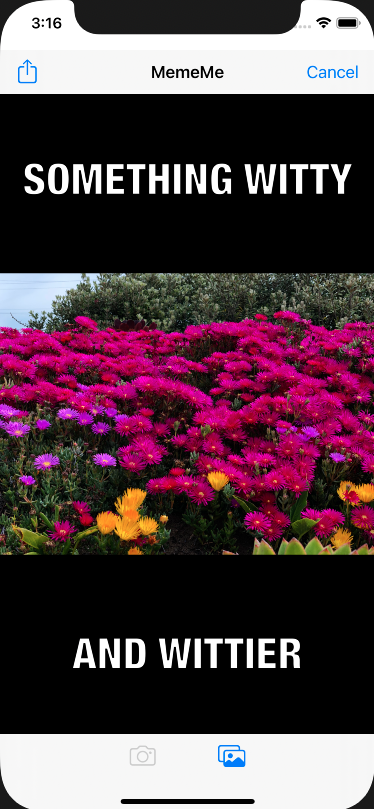

# MemeMe
> A Meme-Making App

[![Swift Version][swift-image]][swift-url]
[![License][license-image]][license-url]

This is MemeMe version 1.0 for Udacity's Nanodegree Track. Create memes with your camera or from your photo library then share with friends!



## Requirements 
- iOS 14.4.1+
- Xcode 9.3+

## Installation
1. Download and drop ```MemeMe.swift``` in your project.  

[swift-image]:https://img.shields.io/badge/swift-5.0-orange.svg
[swift-url]: https://swift.org/
[license-image]: https://img.shields.io/badge/License-MIT-blue.svg
[license-url]: https://opensource.org/licenses/MIT
